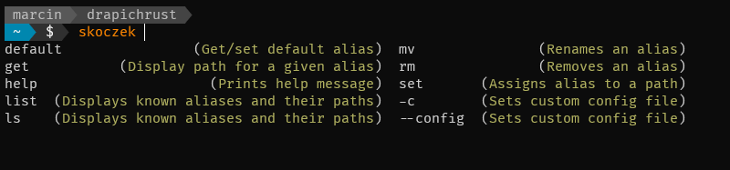
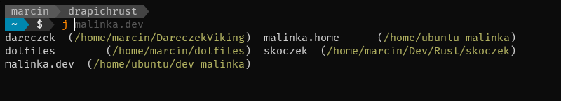

# Skoczek

Command line utility to bookmark interesting paths in filesystems. The tool allows to assign a short name (alias) to the path, and query for paths using aliases.

This tool is made to be used with shell aliases/functions. In this repository I've
added proper files to support `fish` shell.

## Usage

```
skoczek 0.1.2

USAGE:
    skoczek [OPTIONS] <SUBCOMMAND>

FLAGS:
    -h, --help       Prints help information
    -V, --version    Prints version information

OPTIONS:
    -c, --config <FILE>    

SUBCOMMANDS:
    completions    Generate shell completions
    default        Get/set default alias
    get            Displays path for a given alias
    help           Prints this message or the help of the given subcommand(s)
    ls             Displays known aliases and their paths
    mv             Rename an alias
    rm             Removes an alias
    set            Assigns alias to a path
```

To get more info on specific subcommand:

```shell
$ skoczek help subcommand
$ skoczek subcommand -h
```

### Local projects

This is a default use case of skoczek. Assign an alias name to a path. For example, to
add `~/Dev/Rust/skoczek` as a project called `skoczek`, go to the path and set an alias.

```shell
$ cd ~/Dev/Rust/skoczek
$ skoczek set skoczek
```

... or from anywhere, provide optional path:

```shell
$ skoczek set skoczek ~/Dev/Rust/skoczek
```

To get the path of a project `skoczek` use `get` subcommand:

```shell
$ skoczek get skoczek
```

To list available local projects use `ls` subcommand. Additional option `-p` adds paths to the output.

```shell
$ skoczek list -p
dareczek  /home/marcin/DareczekViking
dotfiles  /home/marcin/dotfiles
skoczek   /home/marcin/Dev/Rust/skoczek
```

### Remote projects

Skoczek also supports acessing projects via `ssh`. For this use case `-r remote_name` option is available. For example, to set a path to `~/dev` directory on a `malinka` host:

```shell
$ skoczek set malinka.dev /home/ubuntu/dev -r malinka
$ skoczek get malinka.dev
/home/ubuntu/dev        malinka
```

To get list of remote paths provide `-r` option (list only remotes) or `-a` (list all paths) to `ls` subcommand. 

```shell
$ skoczek ls -rp | column -t
malinka.dev   /home/ubuntu/dev  malinka
malinka.home  /home/ubuntu      malinka
```


### Default projects

It is possible to mark project as a `default` one.

```shell
$ skoczek default -s skoczek
$ skoczek default
skoczek /home/marcin/Dev/Rust/skoczek
```

Output format: alias, path and optional: remote ip, hostname or ssh alias.


## Fish integration

- copy `thisrepo/fish/completions/*.fish` files to `~/.config/fish/completions`
- copy `thisrepo/fish/functions/*.fish` files to `~/.config/fish/functions`

From now on there are two features available. First is `j` function. Usage:

**Go to the default project**

```fish
marcin@drapichrust:~$ skoczek ls -p | column -t
dareczek  /home/marcin/DareczekViking
dotfiles  /home/marcin/dotfiles
skoczek   /home/marcin/Dev/Rust/skoczek

marcin@drapichrust:~$ skoczek default -s skoczek
marcin@drapichrust:~$ j
marcin@drapichrust:~/Dev/Rust/skoczek$ 
```

If no project is assigned as a default, `j` command without arguments will print list of known projects and their paths.

**Go to the specified local project**

```fish
marcin@drapichrust:~/Dev/Rust/skoczek$ j dareczek
marcin@drapichrust:~/DareczekViking$ 
```

**Go to the specified remote project**

```shell
marcin@drapichrust:~/DareczekViking$ j malinka.dev
ubuntu@malinka:~/dev$  
```

The other one is tab-completion for `skoczek` command and `f` function.





## Bash integration

```shell
$ mkdir -p ~/.skoczek
$ cp shell/bash/*.sh ~/.skoczek/
```

Then add the following lines somewhere in `~/.bashrc`:

```bash
if [ -f ~/.skoczek/functions.sh ]; then
    source ~/.skoczek/functions.sh
fi
if [ -f ~/.skoczek/functions.sh ]; then
    source ~/.skoczek/completions.sh
fi
```

